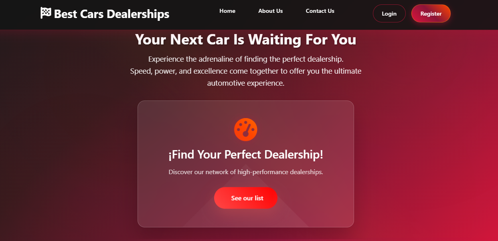

# Best Cars Project

A full-stack web application to browse and publish reviews of car dealerships in the United States. Users can filter dealerships by state, read reviews, and contribute their own opinions after registration.

This project was developed individually as the final project for the **IBM Full Stack Software Developer Professional Certificate**.

## Demo & Media

## Technologies Used

### Frontend
- React  
- JavaScript  
- CSS

### Backend
- Django (server logic)  
- Node.js 
- MongoDB
- Docker  

## Features

- Explore car dealerships across U.S. states
- Read and write reviews (requires login)
- User authentication and registration
- Filter dealerships by state
- Backend microservice runs inside Docker (Node + MongoDB)

## Getting Started

### Prerequisites

- Docker Desktop  
- Python (with virtualenv)  
- Node.js and npm  

### Backend Setup: Node + MongoDB (Docker)

1. Navigate to the database service directory:
cd server/database

2. Build the Docker image:
docker build . -t nodeapp

3. Start the container:
docker-compose up

### Django Setup

1. Navigate to the Django server folder in a new terminal:
cd server

2. Activate the virtual environment:
source virtualenv/Scripts/activate

3. Start the Django development server:
python manage.py runserver

### React Frontend Setup

1. Navigate to the frontend directory in a new terminal:
cd frontend

2. Start the React app:
npm start

This project is for educational purposes.
